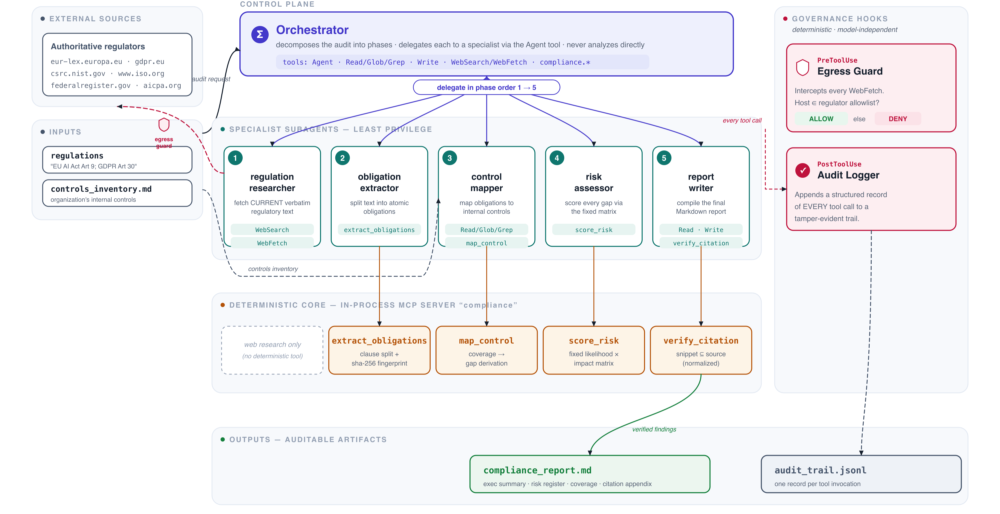
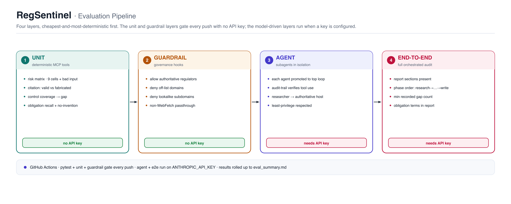

# RegSentinel — Multi-Agent Regulatory Compliance Intelligence

> An orchestrator-led, multi-agent system that audits an organization's internal
> controls against **live** regulatory requirements — built on the
> [Claude Agent SDK](https://code.claude.com/docs/en/agent-sdk/overview) with
> subagents, an in-process MCP server, governance hooks, and resumable sessions.

Compliance is a deliberately hard target for an agentic showcase: it is
high-stakes, it depends on **current** information (regulations change, so stale
model knowledge is a liability), it requires multi-step reasoning across
documents, and — crucially — every claim must be **verifiable**. That last
property is what most agent demos skip and what this project is designed around.

---

## System architecture

<p align="center">
  
</p>

<p align="center"><sub><b>Figure 1.</b> The orchestrator owns the plan and delegates each phase to a specialist subagent (least privilege — only the researcher reaches the web, only the writer writes files). The four deterministic MCP tools form an auditable core, and two governance hooks intercept <i>every</i> tool call: a <code>PreToolUse</code> egress guard and a <code>PostToolUse</code> audit logger. Vector source: <a href="docs/architecture.svg"><code>docs/architecture.svg</code></a> (PNG: <a href="docs/architecture.png"><code>docs/architecture.png</code></a>), regenerated by <a href="docs/make_diagrams.py"><code>docs/make_diagrams.py</code></a>.</sub></p>

## What it does

Given a list of regulations (e.g. `"EU AI Act Article 9; GDPR Article 30"`) and
an organization's control inventory, RegSentinel runs a five-phase audit and
produces an auditable Markdown report with a prioritized risk register and a
citation appendix.

```
orchestrator  (delegates, never analyzes directly)
  │
  ├─▶ regulation-researcher   WebSearch / WebFetch   → fetch CURRENT verbatim clause text
  ├─▶ obligation-extractor    mcp: extract_obligations → split into atomic obligations
  ├─▶ control-mapper          Read/Grep + mcp: map_control → map obligations → controls
  ├─▶ risk-assessor           mcp: score_risk          → score every gap (fixed matrix)
  └─▶ report-writer           Write + mcp: verify_citation → compile final report
```

## Why these design choices (the interesting part)

This is built to demonstrate the patterns production agent teams care about, not
just "many agents calling an LLM."

**1. Orchestrator → subagent delegation.** The top-level agent owns the *plan*
and delegates each phase to a specialist via the SDK's `Agent` tool. Each
subagent has its own focused system prompt and toolset.

**2. Least privilege, applied to agents.** Only `regulation-researcher` can
touch the network; only `report-writer` can write files. No single subagent can
*both* fetch the web and write to disk — which bounds the blast radius of a
prompt-injection attack served from a fetched regulator page.

**3. Deterministic core via an in-process MCP server.** Risk scoring, clause
fingerprinting, control-mapping, and citation checks live in real, unit-tested
Python (`src/regsentinel/tools/compliance_tools.py`), exposed as MCP tools with
`create_sdk_mcp_server`. The model *decides* what to score; it never *invents*
the score. The risk band comes from a fixed likelihood × impact matrix, so
findings are reproducible and defensible.

**4. Citation integrity.** `verify_citation` confirms a quoted snippet actually
appears in the cited source before the report asserts it — the system is
structurally biased against fabricated findings.

**5. Governance hooks.** A `PreToolUse` hook enforces a domain allowlist on
every web fetch (egress guard); a `PostToolUse` hook writes a tamper-evident
`audit_trail.jsonl` of every tool call. This is the deterministic governance
layer reviewers in regulated industries look for.

**6. Resumable sessions.** The orchestrator captures the SDK session ID, so a
long audit can be paused and resumed with full context.

**7. Pluggable external MCP servers.** The in-process compliance server sits in
the same `mcp_servers` dict as any external one — the commented filesystem
server shows how to drop in Slack, Jira, or Confluence MCP servers unchanged.

## Project layout

```
regsentinel/
├── src/regsentinel/             # the installable package (src layout)
│   ├── cli.py                   # console entry point (argparse + logging)
│   ├── __main__.py              # enables `python -m regsentinel`
│   ├── config.py                # env-based settings + logging configuration
│   ├── orchestrator.py          # wires agents, tools, hooks, MCP, sessions
│   ├── agents.py                # 5 specialized subagent definitions (least-privilege)
│   ├── hooks.py                 # egress guard + audit-trail governance hooks
│   ├── py.typed                 # ships type information (PEP 561)
│   └── tools/
│       └── compliance_tools.py  # in-process MCP server: deterministic domain logic
├── evals/                       # layered evaluation pipeline (see evals/README.md)
│   ├── datasets/                # versioned golden + adversarial benchmark cases
│   ├── scorers/                 # pure, independent grading oracles
│   ├── run_unit_evals.py        # deterministic MCP-tool evals (no API key)
│   ├── run_guardrail_evals.py   # egress-allowlist evals (no API key)
│   ├── run_agent_evals.py       # per-subagent isolation evals (needs API key)
│   └── run_end_to_end_evals.py  # full-audit evals (needs API key)
├── tests/                       # unit tests for the auditable core + eval layers
├── examples/run_audit.py
├── sample_data/controls_inventory.md
├── .github/workflows/regsentinel-evals.yml   # CI: tests + deterministic evals
├── requirements.txt
└── pyproject.toml
```

## Evaluation pipeline

A multi-agent compliance system is only trustworthy if you can *prove* each
agent did its job. RegSentinel ships a layered eval pipeline (`evals/`) that
asks: did each agent perform its assigned task correctly — with verified
sources, deterministic risk scoring, safe tool use, and a report a human
reviewer can trust?

<p align="center">
  
</p>

<p align="center"><sub><b>Figure 2.</b> Four eval layers, cheapest-and-most-deterministic first. Vector source: <a href="docs/eval_pipeline.svg"><code>docs/eval_pipeline.svg</code></a> (PNG: <a href="docs/eval_pipeline.png"><code>docs/eval_pipeline.png</code></a>).</sub></p>

It evaluates at four levels:

- **unit** — the deterministic MCP tools (risk matrix, citation integrity,
  control mapping, obligation extraction). Pure Python, no API key.
- **guardrail** — the egress-allowlist hook denies off-list domains (including
  lookalike subdomains) and allows authoritative regulators. No API key.
- **agent** — each specialist subagent in isolation, verified against the audit
  trail to confirm it used its assigned least-privilege tools.
- **end-to-end** — the full orchestrated audit: required report sections,
  correct phase order (research → extract → map → score → write), and a minimum
  recorded gap count.

The deterministic layers gate every push via GitHub Actions; the model-driven
layers run when `ANTHROPIC_API_KEY` is configured and skip cleanly otherwise.
The scorers are **independent oracles** — e.g. the risk scorer keeps its own
copy of the matrix so drift in the tool is caught, not mirrored. See
[`evals/README.md`](evals/README.md).

```bash
python -m evals.run_unit_evals          # 25 deterministic cases, no key
python -m evals.run_guardrail_evals     # egress allow/deny cases, no key
pytest -q                               # core + eval layers under CI
```

## Quickstart

```bash
pip install -e ".[dev,evals]"              # editable install + tooling/eval extras
export ANTHROPIC_API_KEY=sk-ant-...        # from https://platform.claude.com/

# run an audit (console script or module form)
regsentinel "EU AI Act Article 9; GDPR Article 30" sample_data
python -m regsentinel "GDPR Article 30" sample_data

# run the deterministic-core tests
pytest -q
```

Output: `compliance_report.md` (the deliverable) and `audit_trail.jsonl` (the
governance log) in the working directory.

## Configuration

All runtime knobs are environment variables with safe defaults, validated by
**pydantic-settings** and resolved once in
[`src/regsentinel/config.py`](src/regsentinel/config.py) (invalid values — an
unknown permission mode, a non-positive turn budget — fail fast at startup). See
[`.env.example`](.env.example):

| Variable | Default | Purpose |
|---|---|---|
| `REGSENTINEL_AUDIT_LOG` | `audit_trail.jsonl` | path for the audit trail |
| `REGSENTINEL_ALLOWED_FETCH_DOMAINS` | regulator allowlist | comma-separated egress allowlist |
| `REGSENTINEL_SUBAGENT_MODEL` | `sonnet` | model id for the specialist subagents |
| `REGSENTINEL_MAX_TURNS` | `60` | orchestrator turn budget |
| `REGSENTINEL_PERMISSION_MODE` | `acceptEdits` | Claude Agent SDK permission mode |
| `REGSENTINEL_LOG_LEVEL` | `INFO` | logging verbosity |

## Tech

Python 3.10+, `claude-agent-sdk` (the same harness that powers Claude Code),
the Model Context Protocol for tool integration, and `pydantic-settings` for
validated configuration. Model: Claude (Sonnet for subagents; configurable).

## Notes & honest limitations

- `sample_data/controls_inventory.md` is illustrative; point the control-mapper
  at your real inventory (or a Confluence/Drive MCP server) for live use.
- The egress allowlist defaults are intentionally small — set
  `REGSENTINEL_ALLOWED_FETCH_DOMAINS` (see [Configuration](#configuration)) for
  the regulators you actually consult.
- This is a reference architecture, not legal advice; a human compliance officer
  signs off on findings.
